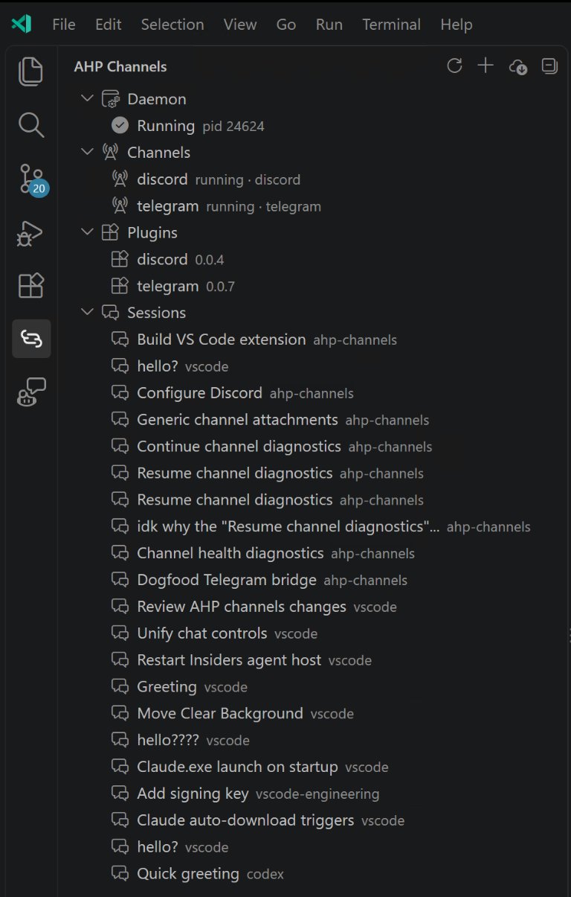

# AHP Channels

**Your agent conversations, connected to your chat apps.**

Connect Claude Code channel plugins, including Discord and Telegram, to an
existing [Agent Host Protocol](https://www.npmjs.com/package/@microsoft/agent-host-protocol)
conversation. Install plugins, manage the background daemon, and choose where
messages go without leaving VS Code.

**The runtime and daemon are bundled. No separate `ahp-channels` CLI installation
is required.**

  

## One view for your channels

Open **AHP Channels** in the Activity Bar.

| Section | What you can do |
| --- | --- |
| **Daemon** | Start, stop, or restart the background daemon and open its log. |
| **Channels** | Create named channels, check their status, and control or redirect them. |
| **Plugins** | See installed plugins and their versions, and install more from a marketplace. |
| **Sessions** | Browse conversations from discovered local Agent Hosts and pick a destination. |

Actions are available through hover buttons, right-click menus, and the Command
Palette. Search for **AHP Channels** to see the commands.

## Before you start

- **A running local Agent Host and an existing agent conversation.** Use a VS Code
  build that exposes Agent Host endpoints, with your agent provider configured.
  An ordinary editor window alone does not guarantee a host is available.
- **Git** on your PATH for installing marketplace plugins.
- **Your plugin's runtime and account requirements.** The official Discord and
  Telegram plugins currently require [Bun](https://bun.sh/docs/installation).

The extension manages the channel daemon, not the Agent Host itself. It does not
create conversations or sign you in to an agent provider.

## Connect your first channel

1. Open **AHP Channels** from the Activity Bar.
2. Choose **Install Plugin...** and enter a plugin specification:
   - Discord: `discord@claude-plugins-official`
   - Telegram: `telegram@claude-plugins-official`
3. Choose **Create Channel...**, select the installed plugin and receiving
   session, and give the channel a name. The daemon starts automatically.
4. Open **that same agent conversation** and complete the plugin's setup:
   - Discord: `/discord:configure`, then `/discord:access`
   - Telegram: `/telegram:configure`, then `/telegram:access`
5. Follow the plugin's pairing instructions, send a message from your chat app,
   and verify that the agent replies there.

The setup and access commands are **agent skills, not shell commands**. Keep bot
tokens private, follow the plugin's credential-storage guidance, and approve
only the senders you want to reach your agent.

## Point a channel at another conversation

In the AHP Channels view, right-click a row under **Sessions**, choose
**Point Channel Here...**, and select the channel to move.

You can also right-click a channel and choose **Select Session...**. The chosen
session receives subsequent messages; it does not have to be the conversation
currently focused in the editor.

Channels already attached for setup can move their setup skills to another
session even when the messaging server still cannot start. You do not need to
stop and restart the channel first. Working channels retain failed-handoff
rollback protection, and handoffs never interrupt an active turn.

## Controls and troubleshooting

**Stop Channel** disables the channel and its automatic retries.
**Restart Channel** retries it immediately when the conversation is idle.
Both remain available for an enabled channel reporting an error.
Stopping the daemon stops all its channels; closing the view does not stop it.

Channel rows distinguish **connected** (messaging server running) from
**attached for setup** (plugin skills available, messaging unavailable). An
**error** without a setup-only attachment means the channel has no usable
connection.

Hover over a channel to see its health, failure reason and stage, recovery
guidance, and scheduled or exhausted retries. A scheduled retry waits until
the conversation is idle. Failed handoffs also show the requested session and
error without changing the status of a restored healthy connection. Choose
**Refresh** to read the latest daemon status after automatic recovery.

### No sessions are listed

Make sure a supported local Agent Host is running and has an existing
conversation, then choose **Refresh**. Check the **AHP Channels** output channel
for connection or discovery errors.

Local Unix-socket and Windows named-pipe connections preserve their endpoint
under VS Code's HTTP proxy handling; you do not need to disable proxy support.

### An older configuration is unsupported

Extension updates also update its bundled bridge runtime; a separate npm CLI
update is not required. Configuration schema versions are different from
extension release versions. Version 2 configuration predates versioned plugin
installations and is not migrated automatically. A v2 configuration upgrade
action is not available yet; preserve the old configuration and do not change
its version number by hand.

### A channel reports an error during setup

A plugin may need credentials before its messaging server can start. A channel
marked **attached for setup** still provides its setup skills in the selected
session. Follow the recovery guidance in its tooltip; the daemon retries after
the setup turn completes.

Use **Open Daemon Log** for the plugin's diagnostic, such as a missing bot token
or Bun installation. A generic `MCP error -32000: Connection closed` is not the
underlying cause.

### A required executable is missing

The MCP launch configuration declares the executable, such as `bun`, `node`,
or `python`. If it cannot be launched because it or its interpreter is missing,
the channel tooltip identifies the command and provides recovery guidance.
Setup skills remain available. Missing working directories are reported
separately; the extension does not infer runtime requirements from plugin names
or inspect credentials.

Install the runtime and restart the daemon so it inherits an updated `PATH`.
If needed, restart VS Code from that environment first. Restarting only the
channel reuses the daemon's old environment.

### A token saved on Windows is reported as missing

Some Telegram and Discord plugin versions cannot parse CRLF credential files.
Save the plugin's credential file as UTF-8 with **LF** line endings, then retry
the channel when idle. Do not share the file contents. The parser fix belongs
in the plugin; this extension does not rewrite credential files or installed
plugin snapshots.

### A setup skill is missing

Make sure the channel is started and you are in its selected conversation.
Use **Select Session...** to move a setup-only attachment to the conversation
you want. If the host or session cannot be reached, the handoff fails and
restores the source binding; inspect the channel tooltip for the failure.

## Settings and the CLI

| Setting | Description |
| --- | --- |
| `ahpChannels.home` | Override the bridge's state directory. Leave empty to use `AHP_CHANNELS_HOME`, or `~/.ahp-channels` when it is unset. |

The extension and the optional [CLI](../README.md) share their daemon,
configuration, and installed plugins when they use the same state directory.
Plugin credentials and access policies remain plugin-managed. Use only one
running bridge per bot account.

---

[Documentation](../README.md) |
[Source code](https://github.com/TylerLeonhardt/ahp-channels) |
[Report an issue](https://github.com/TylerLeonhardt/ahp-channels/issues)
